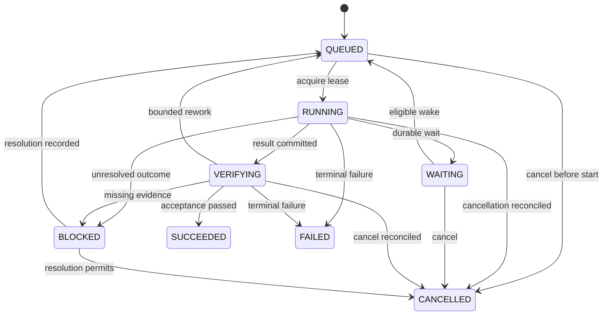

# Execution and Recovery

## Ownership ของงาน

LLM เสนอ next action ส่วน controller เป็นผู้ตรวจ preconditions, resources, permission และ commit state งานหนึ่งมี logical ticket เดียวแต่มีหลาย attempt ได้ ผลงานกับการส่งผลเป็นคนละสถานะเพื่อให้ส่งซ้ำได้โดยไม่ทำงานซ้ำ

## Ticket state machine

Attempt มี PREPARED, DISPATCHED, SUCCEEDED, FAILED, CANCELLED, UNKNOWN; UNKNOWN เป็นความไม่แน่ใจของผล external call ไม่ใช่เหตุผลให้ตั้ง ticket เป็น SUCCEEDED หรือ retry ทันที

Delivery มี PENDING, SENDING, DELIVERED, UNKNOWN, FAILED แยกจาก ticket: SUCCEEDED + delivery PENDING เป็นสถานะที่ถูกต้อง

## Transaction boundaries

1. รับ request และ idempotency key; commit ticket + queued event ก่อน ACK ว่ารับงานแล้ว
2. claim งานโดย revision/lease guard; commit attempt PREPARED และ epoch
3. บันทึก request/operation identity ก่อน dispatch; external call อยู่นอก transaction
4. บันทึก result/evidence และ attempt outcome ด้วย epoch ที่ยังใช้ได้
5. validation ผ่านจึง commit success + outbox ใน transaction
6. delivery worker ส่งผลโดย delivery ID; commit receipt หลังทราบผล

network timeout ไม่พิสูจน์ว่า provider ไม่ได้ทำงาน การรับประกัน exactly-once ฝั่งระบบภายนอกทำไม่ได้ทั่วไป ใช้ idempotency เมื่อปลายทางรองรับและ reconciliation เมื่อไม่รู้ผล

## Leases และการหยุด runtime เก่า

lease มี owner, epoch, expiry และ heartbeat แต่ expiry เป็นเพียงสิทธิ์พิจารณารับช่วง การเขียน state และ capability dispatch ต้องตรวจ epoch ปัจจุบันทุกครั้ง

stale worker ต้อง commit ไม่ได้; การกั้น DB ไม่สามารถย้อน external request ที่ส่งไปแล้ว ต้องเก็บ UNKNOWN และสอบผลก่อน replay ระหว่าง update ให้ drain หรือยุติ runner เก่าพร้อมตรวจ resource ที่ถืออยู่ก่อนปล่อยรุ่นใหม่รับงาน

## Recovery policy

| จุดขัดข้อง | หลักฐานที่อ่าน | การดำเนินการ |
| --- | --- | --- |
| ก่อน ingress commit | ไม่มี ticket | รับ request เดิมอีกครั้งได้ |
| หลัง commit ก่อน ACK | ingress_key เดิม | คืน ticket เดิม |
| หลัง PREPARED ก่อนส่ง | dispatch marker/receipt | ส่งเมื่อพิสูจน์ว่ายังไม่ dispatch; มิฉะนั้น UNKNOWN |
| ส่งแล้วไม่ได้ response | provider operation ID | query/reconcile; ห้าม blind retry side effect |
| result commit แล้ว process ตาย | result/evidence | ทำ validation ต่อ |
| success commit แล้วส่งไม่ถึง | outbox | ส่งผลเดิมโดย dedupe key |
| lease หมดแล้ว worker เก่ากลับ | epoch mismatch | ปฏิเสธ commit/dispatch และ reconcile in-flight |
| ผู้ใช้ cancel ระหว่างรอ | durable cancel flag | ไม่มี wake ใหม่; ตรวจงานที่หยุดไม่ได้แล้วรายงาน |

## Scheduling และความต่อเนื่อง

Solo ใช้ concurrency = 1 แต่สลับ worker/reviewer/controller โดยสร้าง context ใหม่ตามบทบาท Multi เพิ่ม slots ภายใต้ quota และ dependency graph เดิม

Project controller ต้องบันทึกเหตุผลของ next action, progress signal, remaining budget และ wake condition วงจรที่ไม่คืบตามจำนวนครั้งกำหนดต้อง BLOCKED พร้อมหลักฐาน ไม่สั่ง “ลองอีกครั้ง” ไม่จำกัด

Wait condition ต้องเป็นข้อมูล เช่น event key, not-before time, dependency revision หรือ user input needed Runner แบบ background เป็น capability ที่เปิดใช้และทดสอบแยกจาก CLI; เอกสารอย่างเดียวไม่ทำให้ระบบเดินอัตโนมัติ

## สิทธิ์และการตรวจรับ

tool access บังคับที่ capability runtime ไม่พึ่งข้อความใน skill รายการผลที่ต้องตรวจขึ้นกับงาน: code ใช้ tests/artifact, งานเอกสารใช้ rubric และ source checks, คำตอบทั่วไปไม่ต้องมี reviewer สามตัวเสมอ

การใช้ reviewer provider เดียวกันยังเสี่ยงผิดร่วมกัน จึงแยก context และใช้หลักฐานจากเครื่องมือ ไม่มีคำรับรองว่าการลงมติของหลาย session เท่ากับความถูกต้อง
