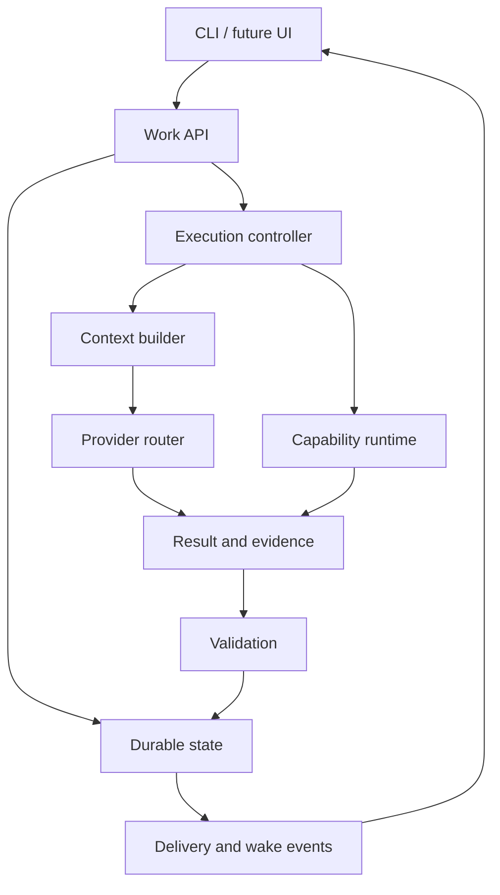

# System Architecture

**สถานะ:** DESIGN_PROPOSAL; แนวคิด Work Unit และลำดับ phase เป็น USER_DIRECTION

## ขอบเขตความรับผิดชอบ

Zooid เป็นเจ้าของสถานะและสิทธิ์การเปลี่ยนสถานะของงาน โมเดลสร้างข้อเสนอและผลลัพธ์ ส่วน runtime ตรวจสัญญา/หลักฐานก่อน commit ผล โมเดลหรือ provider ใดจึงไม่ใช่เจ้าของประวัติทั้งหมดของผู้ใช้

เสนอ modular monolith บนเครื่องเดียวก่อน แยก module ตาม ownership และ transaction boundary ไม่แยกเป็นหลาย service โดยไม่มีเหตุผลจากงานจริง

ภาพนี้แสดงปลายทางระดับ Project ไม่ใช่รายการที่ต้องติดตั้งทั้งหมดในขั้น 1

| ส่วน | รับเข้า | ส่งออก | เริ่มสร้าง |
| --- | --- | --- | --- |
| Interface | ข้อความ/คำสั่งผู้ใช้ | command + stable request ID | 1 |
| Session store | neutral messages | ordered transcript | 1 |
| Provider adapter | request + cancel signal | normalized events/errors/usage | 1 |
| Router | route preference + capabilities | selected route + reason | 2 |
| Ticket store | command + scope | committed ticket + events | 3 |
| Controller | ready ticket + lease | attempt/result/state transition | 3–4 |
| Context builder | task/role/budget/source revision | context manifest + bounded input | 5 |
| Capability runtime | allowed operation | receipt/evidence | 5 pilot |
| Validator | expected outputs + evidence | pass/rework/blocked | 5 |
| Project/Group coordinator | dependencies + objective | eligible work + scoped handoff | 5–6 |

## สัญญาร่วมที่ต้องยึด

- IDs ของ session/work unit/ticket/message เป็นของ Zooid; provider response ID เป็นเพียง reference
- ข้อมูลที่ provider ไม่รองรับต้องแจ้งก่อน dispatch ไม่แปลงทิ้งโดยเงียบ
- งานที่มีผลต่อสถานะ durable ต้องมี expected revision หรือ transaction guard
- external I/O ไม่อยู่ภายใน DB transaction ที่เปิดค้างระหว่างรอ network
- adapter ไม่แก้ ticket status โดยตรง; ส่งผลกลับให้ controller
- validator ไม่รับรองความถูกต้องด้วยข้อความ “เสร็จแล้ว” เพียงอย่างเดียว
- authentication secret ใช้ credential reference; ไม่ใส่ใน transcript, context, event หรือ Git

## Proposed file map

ใช้เป็นแผนแบ่งความรับผิดชอบ ไม่สร้างไฟล์เปล่าทั้งชุดในขั้น 1

| Path | หน้าที่ |
| --- | --- |
| src/cli/chat.ts | อ่านคำสั่งและแสดงผล |
| src/config/settings.ts | config และ credential references |
| src/chat/messages.ts | neutral message types |
| src/chat/session-store.ts | session identity/transcript |
| src/providers/contracts.ts | provider request/result/capability |
| src/providers/registry.ts | adapter registration |
| src/providers/router.ts | routing decision |
| src/providers/adapters/ | protocol adapters |
| src/storage/database.ts | transaction boundary |
| src/storage/migrations/ | schema migration ที่มีความหมาย |
| src/tickets/ticket-service.ts | ingress และ state transition |
| src/execution/runner.ts | attempt dispatch |
| src/execution/recovery.ts | reconcile after restart |
| src/execution/outbox.ts | durable result delivery |
| src/context/context-builder.ts | bounded context |
| src/memory/knowledge-store.ts | accepted facts/decisions/source refs |
| src/work/work-unit-service.ts | structure and membership operations |
| src/projects/scheduler.ts | role/dependency/resource scheduling |
| src/groups/coordinator.ts | scoped coordination |
| src/capabilities/registry.ts | tool declarations and permissions |
| src/lifecycle/manager.ts | installation ownership and lifecycle |

## เส้นแบ่ง complexity

ขั้น 1 ใช้ session/message types ที่ตรงไปตรงมาและ interface provider เพียงอันเดียว การเก็บประวัติเริ่มด้วยไฟล์ที่เขียนแบบ atomic ได้ ก่อน migrate เข้า DB ขั้น 3 ให้มี import ที่ตรวจจำนวน/order/identity

ไม่มี requirement ว่าต้อง event-source ข้อมูลทุกชนิด Ledger ใช้บันทึกการเปลี่ยนสถานะสำคัญ ส่วน projection เป็นข้อมูล query ปัจจุบัน ภาพ/ไฟล์ใหญ่เก็บใน artifact store; ไม่ทำ DB ให้กลายเป็น transcript ทั้งหมดที่ส่งเข้าโมเดลทุกครั้ง
